🛒 Marketi App
A modern, full-featured E-Commerce mobile application built with Flutter, following Clean Architecture principles and best industry practices to ensure scalability, maintainability, and optimal performance.

📸 Screenshots
Note: Make sure to place your app screenshots inside a screenshots/ directory in the root of your project, or replace the src links above with your hosted image URLs.

  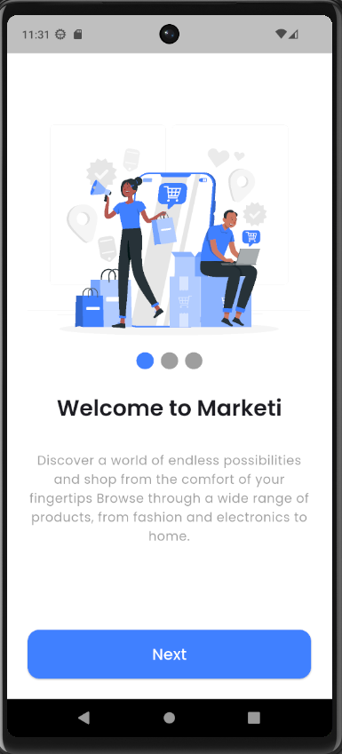
  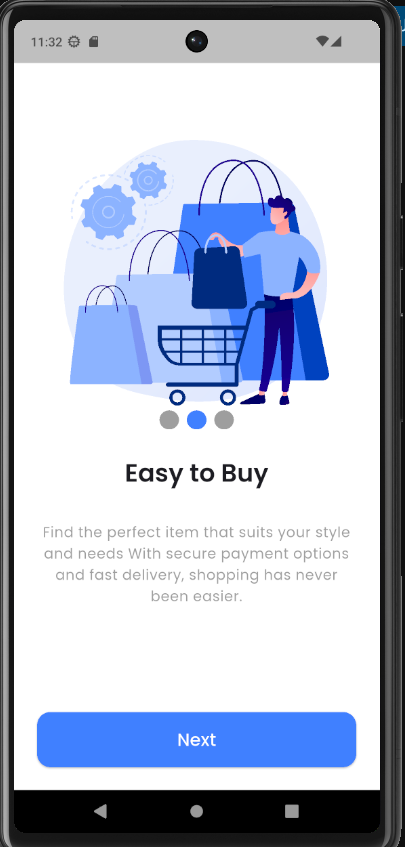
  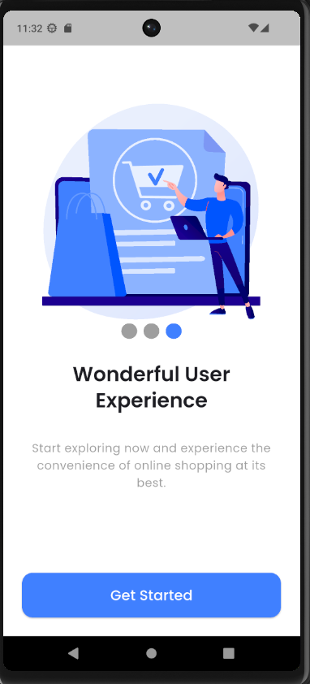
  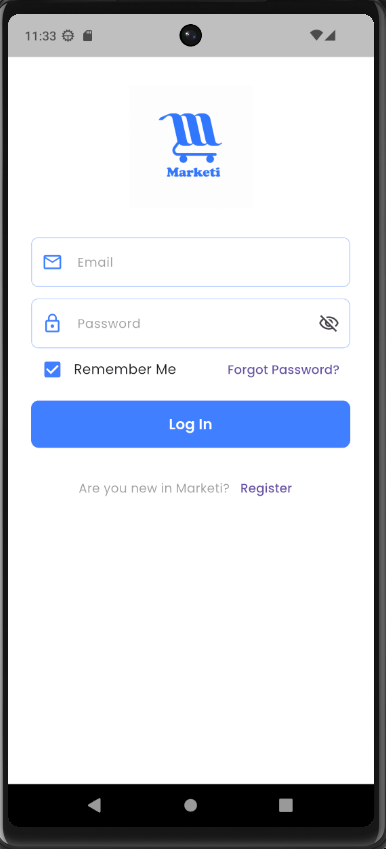
  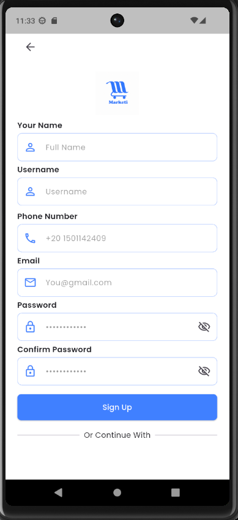
  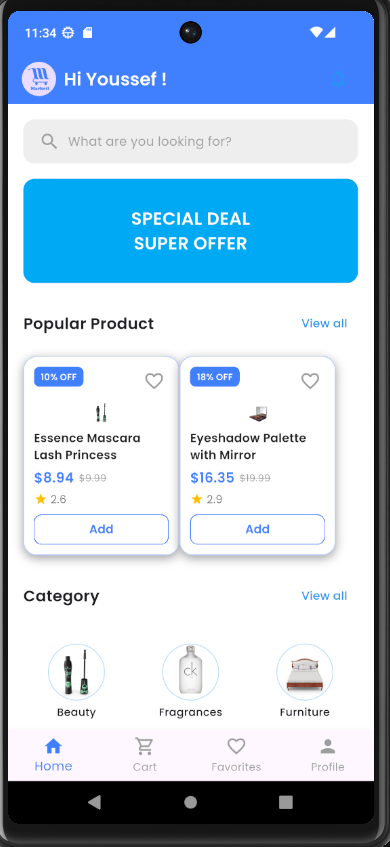
  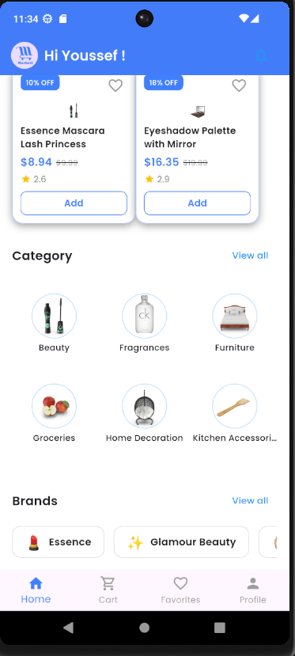
  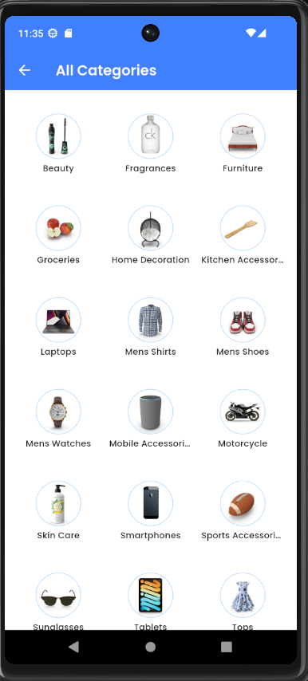
  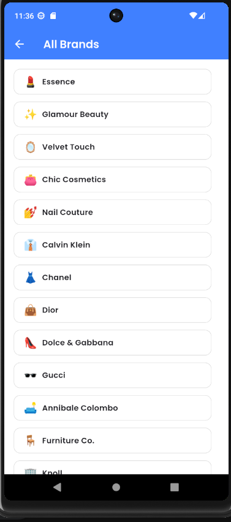
  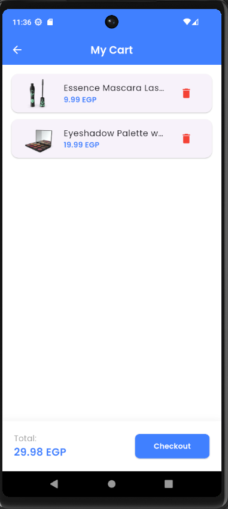
  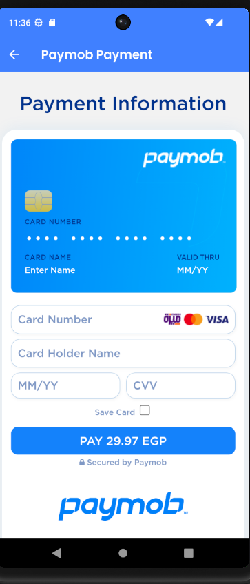
  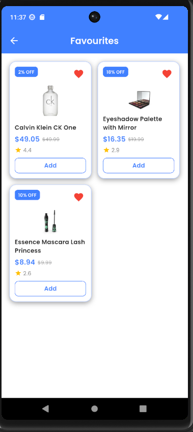
  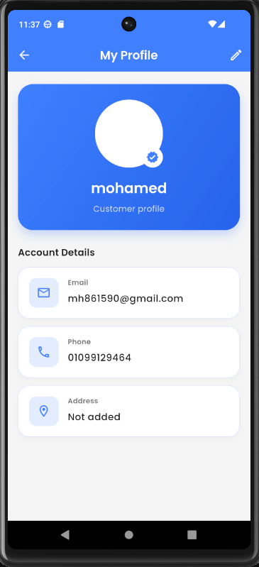

🌟 Key Features
Onboarding Experience: Smooth walkthrough screens for new users.

Authentication & Security:

Login and Sign Up functionality.

Remember Me option with secure local storage.

Product Discovery & Search:

Explore categories, featured brands, and promotional banners.

Instant search and item filtering.

Cart & Wishlist Management:

Add, update, or remove items with real-time price calculation.

Save favorite products for quick access.

Payment Integration:

Integrated with Paymob payment gateway via WebView for secure online transactions.

User Profile: Manage user details and application settings.

🏗️ Tech Stack & Architecture
This project is built using Clean Architecture to ensure separation of concerns, high testability, and easy scalability.

Framework: Flutter

State Management: BLoC / Cubit

Networking: Dio (with API Interceptors & Exception Handling)

Dependency Injection: GetIt

Local Storage: Shared Preferences (Cache Helper)

Navigation: GoRouter / App Router

Plaintext
lib/
├── core/
│   ├── common/         # Standalone and reused UI widgets
│   ├── errors/         # Custom exception handling & error models
│   ├── helper/         # Cache and local storage helpers
│   ├── network/        # ApiConsumer & Dio setup
│   ├── routing/        # App routing configuration
│   ├── services/       # Dependency Injection (GetIt) setup
│   └── themes/         # Color palettes & App Themes
│
└── features/
    ├── auth/           # Login & Sign-Up flow
    ├── cart/           # Cart management
    ├── favorite/       # Favorite products list
    ├── home/           # Dashboard, Categories, Brands & Products
    ├── onboarding/     # Intro screens
    ├── payment/        # Paymob integration & Checkout flow
    ├── profile/        # User Profile Management
    └── search/         # Product search feature
🚀 Getting Started
Prerequisites
Flutter SDK installed on your machine.

Android Studio or VS Code with Flutter extensions.

Installation
Clone the repository:

Bash
git clone https://github.com/MohamedHany1512/marketi-app.git
cd marketi-app
Fetch project dependencies:

Bash
flutter pub get
Run the application:

Bash
flutter run
